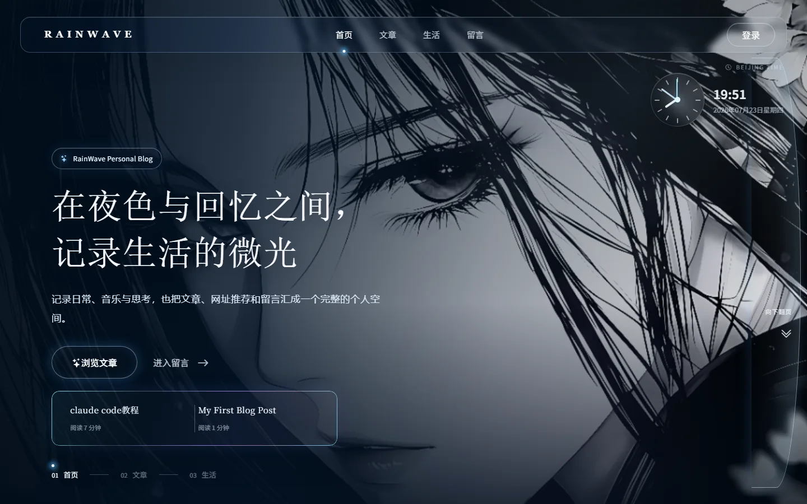
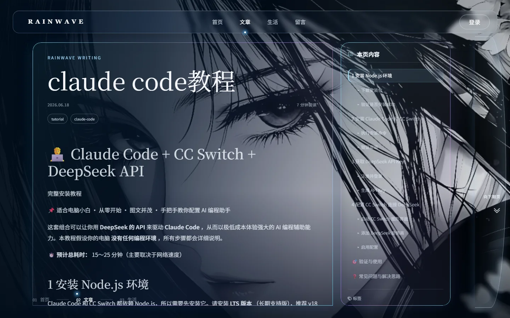
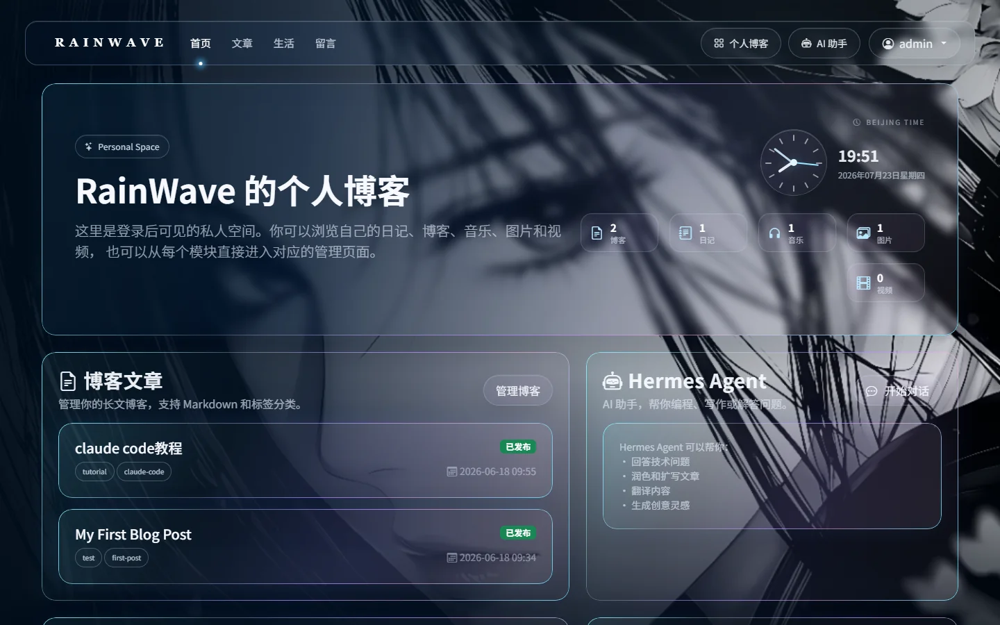
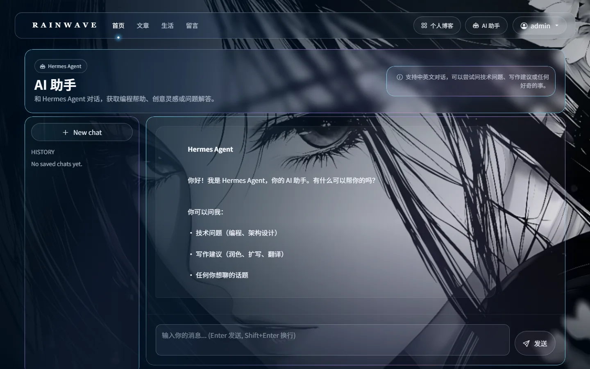
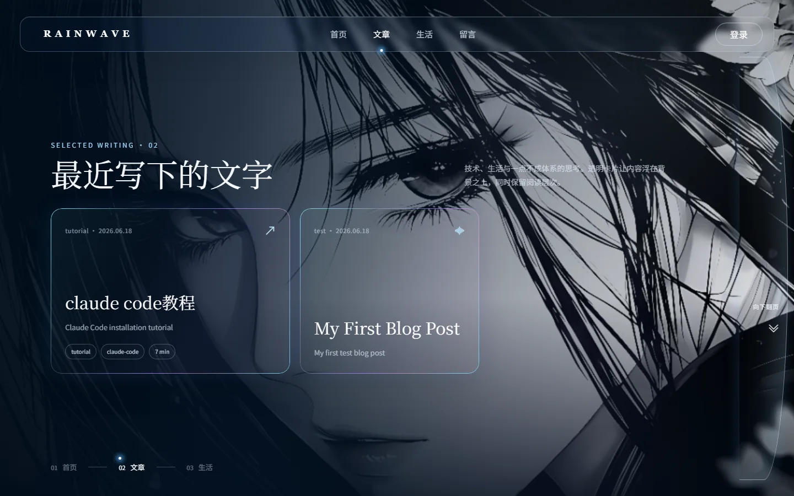
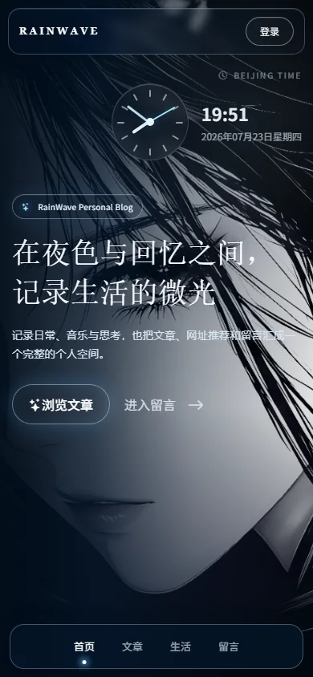
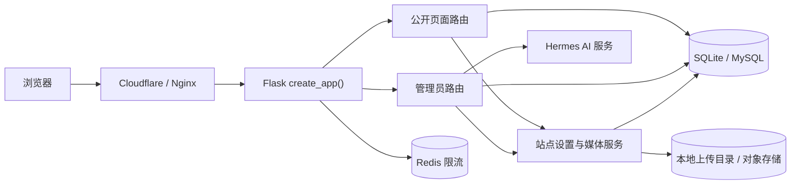

# RainWave Personal Blog

一套面向个人内容创作与管理的 Flask 博客系统。网站采用全屏背景、低填充透明玻璃卡片、全息描边和电影感排版，同时提供文章、日记、媒体、留言审核、背景轮播、首页文案配置和 Hermes AI 助手。



## 项目特点

- **公开网站**：首页、文章列表、文章详情、生活网址和留言板。
- **内容后台**：博客文章、日记、图片、音乐和视频管理。
- **站点设置**：首页与后台背景、图片轮播、时钟样式和首页文案配置。
- **AI 助手**：带本地会话记录、异步任务状态和文章写作辅助的 Hermes 集成。
- **视觉系统**：响应式透明玻璃界面、全息描边、页面过渡、文章目录和自定义播放器。
- **安全基线**：CSRF、CSP nonce、可信主机、登录限流、可选 TOTP、可选 Turnstile、上传内容检测和 Markdown 白名单净化。
- **部署友好**：支持 SQLite 本地开发和 MySQL 生产数据库，提供 Gunicorn、Nginx、Redis 配置入口。

## 页面预览

| 文章阅读与右侧目录 | 管理员个人博客 |
| --- | --- |
|  |  |

| 设置中心 | Hermes AI 助手 |
| --- | --- |
|  |  |

<details>
<summary>查看更多截图</summary>

### 文章列表



### 移动端首页



</details>

## 技术栈

| 层级 | 技术 |
| --- | --- |
| Web 框架 | Flask 3.1 |
| 模板渲染 | Jinja2 服务端渲染 |
| 数据访问 | Flask-SQLAlchemy / SQLAlchemy |
| 身份认证 | Flask-Login |
| 表单与 CSRF | Flask-WTF / WTForms |
| 请求限流 | Flask-Limiter |
| 数据库 | SQLite（本地）/ MySQL + PyMySQL（生产） |
| 前端 | HTML、CSS、原生 JavaScript、Bootstrap、Bootstrap Icons |
| Markdown | Python-Markdown、Pygments、nh3 |
| 文件识别 | filetype、Pillow |
| AI 接口 | Hermes Agent / OpenAI 兼容 API |
| 浏览器测试 | Selenium + Chrome |
| 生产运行 | Gunicorn + Nginx，可选 Cloudflare |

RainWave 在目录层面区分前端与后端，但运行方式是 **Flask 服务端渲染应用**，不是前后端分别部署的 SPA。

## 系统架构



应用入口为 `backend/core/app.py` 中的 `create_app()`：

1. 加载运行配置并校验密钥、数据库和可信主机。
2. 初始化 SQLAlchemy、Flask-Login、CSRF 和限流器。
3. 注册公开页面、认证、内容、审核、设置、博客和 Hermes 路由。
4. 为请求生成 CSP nonce，并统一附加安全响应头和缓存策略。
5. 创建数据库表、上传目录和默认站点设置。

## 目录结构

```text
Personal-Blog/
├─ backend/
│  ├─ core/
│  │  ├─ app.py            # 应用工厂、扩展初始化和安全中间件
│  │  ├─ config.py         # 环境变量、数据库和生产配置
│  │  ├─ constants.py      # 背景、时钟、媒体和 Hermes 常量
│  │  ├─ forms.py          # WTForms 表单及字段验证
│  │  └─ models.py         # 数据模型
│  ├─ public/
│  │  └─ pages.py          # 首页、文章、网址、留言、站点地图
│  └─ admin/
│     ├─ auth.py           # 登录、退出、权限和安全响应头
│     ├─ blog.py           # Markdown 博客管理与公开详情
│     ├─ content.py        # 日记与媒体管理
│     ├─ review.py         # 留言及历史投稿审核
│     ├─ settings.py       # 背景、轮播、时钟和首页设置
│     └─ hermes.py         # AI 会话、异步任务与写作辅助
├─ frontend/
│  ├─ templates/
│  │  ├─ public/           # 公开页面模板
│  │  ├─ admin/            # 后台页面模板
│  │  └─ base.html         # 全站布局、导航、背景和页面骨架
│  └─ static/
│     ├─ css/              # RainWave 视觉系统
│     ├─ js/               # 页面切换、下拉框、时钟、目录和播放器
│     ├─ assets/           # 默认背景和站点资源
│     ├─ vendor/           # 本地 Bootstrap 与图标资源
│     └─ uploads/          # 本地上传内容，默认不提交 Git
├─ docs/
│  ├─ images/              # README 最终页面截图
│  └─ RainWave-完整复现与开发说明书.md
├─ tests/                  # 单元、安全、性能和浏览器测试
├─ .env.example            # 生产环境变量示例
├─ reset_admin_password.py # 管理员创建与密码重置工具
├─ start_local.ps1         # Windows 本地启动脚本
├─ requirements.txt
└─ requirements-dev.txt
```

## 页面与路由

当前应用包含 35 条业务路由和 1 条 Flask 静态资源路由。

### 公开页面

| 路径 | 方法 | 页面或功能 |
| --- | --- | --- |
| `/` | GET | 公开首页、时钟、首页文案和最近文章 |
| `/articles` | GET | 已发布文章列表与分页 |
| `/blog/post/<slug>` | GET | 已发布文章详情、标签和自动目录 |
| `/links` | GET | 审核通过的生活网址 |
| `/messages` | GET/POST | 留言列表、提交、蜜罐和 Turnstile |
| `/sitemap.xml` | GET | 公开页面与文章站点地图 |
| `/robots.txt` | GET | 搜索引擎访问规则 |
| `/favicon.ico` | GET | 站点图标 |
| `/login` | GET/POST | 管理员登录 |
| `/logout` | POST | 安全退出 |

### 管理员页面

| 路径 | 方法 | 页面或功能 |
| --- | --- | --- |
| `/blog` | GET | 管理员个人博客总览 |
| `/admin` | GET/POST | 设置中心与留言审核 |
| `/manage/blog` | GET | 博客文章管理 |
| `/manage/blog/new` | GET/POST | 新建 Markdown 文章 |
| `/manage/blog/edit/<id>` | GET/POST | 编辑文章 |
| `/manage/blog/delete/<id>` | POST | 删除文章 |
| `/manage/diaries` | GET/POST | 日记发布与管理 |
| `/manage/music` | GET/POST | 音乐上传、试听和管理 |
| `/manage/images` | GET/POST | 图片上传、预览和管理 |
| `/manage/videos` | GET/POST | 视频上传、预览和管理 |
| `/delete/<id>` | POST | 删除媒体文件与记录 |
| `/delete-diary/<id>` | POST | 删除日记 |
| `/chat` | GET | Hermes AI 助手 |

此外还保留 Article、Link 和 Message 的审核/删除端点，用于兼容已有数据和审核流程。

### Hermes API

| 路径 | 方法 | 用途 |
| --- | --- | --- |
| `/api/hermes/conversations` | GET/POST | 获取或创建会话 |
| `/api/hermes/conversations/<id>/messages` | GET | 获取会话消息 |
| `/api/hermes/chat` | POST | 创建异步聊天任务 |
| `/api/hermes/chat/jobs/<job_key>` | GET | 查询任务状态 |
| `/api/hermes/writing-assist` | POST | 润色、扩写、摘要和翻译 |
| `/api/import-file` | POST | 将 Markdown、文本或 HTML 导入编辑器 |

## 功能说明

### 公开首页

- 管理员可配置欢迎语、个性描述、字体和颜色。
- 支持图片、动图、视频或图片文件夹轮播背景。
- 北京时间组件支持数字、文字和模拟时钟样式。
- 展示最近发布文章并提供页面切换入口。
- 桌面端支持翻页提示、键盘和滚轮导航；移动端使用底部导航。

### 博客文章

- 后台使用 Markdown 创建和编辑文章。
- 保存时生成并净化 HTML，公开访问无需重复渲染 Markdown。
- 支持草稿、发布状态、摘要、标签、封面和自定义 slug。
- 文章详情根据 `h2`、`h3` 自动生成右侧目录。
- 支持 `.md`、`.markdown`、`.txt`、`.html` 和 `.htm` 内容导入。

### 日记和媒体

- 管理员可发布和删除日记。
- 图片、视频和音乐共用统一上传与管理架构。
- 浏览器选择文件后提供本地预览。
- 音乐使用自定义玻璃播放器，支持播放、暂停、进度和静音。
- 文件真实类型由文件头检测，不只信任扩展名或浏览器 MIME。

### 背景系统

- 首页和管理员区域分别维护背景。
- 单背景支持服务器素材复用和本地上传。
- 图片轮播可设置切换间隔和参与图片数量。
- 每次请求批量读取站点设置，并在请求内缓存背景目录扫描结果。
- 游客无法修改全站背景；所有背景设置均要求管理员权限。

### 管理员和审核

- Flask-Login 会话认证和管理员权限装饰器。
- 可选 TOTP 动态验证码。
- 留言提交后默认不可见，管理员审核通过后公开。
- 所有修改和删除操作使用 POST 与 CSRF 校验。

### Hermes AI

- 未配置接口时提供本地 Mock 响应，便于开发页面。
- 配置接口后支持 OpenAI Chat Completions 或 Responses 风格端点。
- 本地保存会话、消息和后台任务状态。
- 聊天请求在工作线程执行，浏览器轮询任务状态。
- 写作助手支持润色、扩写、摘要和中英互译。

## 数据模型

| 模型 | 说明 |
| --- | --- |
| `User` | 用户名、密码哈希和管理员权限 |
| `BlogPost` | Markdown、HTML、slug、摘要、标签、封面和发布状态 |
| `DiaryEntry` | 管理员日记 |
| `FileRecord` | 图片、视频和音乐的文件元数据 |
| `SiteSetting` | 背景、时钟和首页文案键值配置 |
| `Message` | 游客留言及审核状态 |
| `Article` | 兼容历史游客文章投稿 |
| `Link` | 生活网址及审核状态 |
| `HermesConversation` | AI 会话 |
| `HermesMessage` | AI 会话消息 |
| `HermesChatJob` | 异步聊天任务状态 |

本项目当前使用 `db.create_all()` 创建表，并在启动时兼容部分旧字段长度。正式生产环境持续演进时，建议接入 Alembic 或 Flask-Migrate 管理数据库迁移。

## 本地运行

### 环境要求

- Python 3.12 或兼容的 Python 3.11+
- Windows PowerShell，或 Linux/macOS Shell
- Chrome（仅截图和 Selenium 视觉测试需要）

### Windows

```powershell
git clone https://github.com/Shuaige-Da/Personal-Blog.git
cd Personal-Blog

python -m venv .venv
.\.venv\Scripts\python.exe -m pip install --upgrade pip
.\.venv\Scripts\python.exe -m pip install -r requirements.txt

.\start_local.ps1
```

打开 <http://127.0.0.1:5000/>。

### Linux / macOS

```bash
git clone https://github.com/Shuaige-Da/Personal-Blog.git
cd Personal-Blog

python3 -m venv .venv
source .venv/bin/activate
python -m pip install --upgrade pip
python -m pip install -r requirements.txt

export LOCAL_DEV=1
python -m backend.core.app
```

首次本地启动会：

1. 创建 `app.db`；
2. 创建 `frontend/static/uploads/` 下的分类目录；
3. 生成仅用于本机开发的 `.local-dev-secret-key`；
4. 写入默认背景、时钟和首页文案设置。

这些本地数据均已通过 `.gitignore` 排除。

## 创建管理员

```powershell
.\.venv\Scripts\python.exe reset_admin_password.py `
  --username admin `
  --password "请替换为至少 12 位的高强度密码" `
  --create-if-missing
```

脚本也可用于重置已有管理员密码。不要在生产命令历史、README、截图或 Git 提交中使用真实密码。

生产环境还可以在首次启动时同时提供：

```text
INIT_ADMIN_USERNAME=<管理员用户名>
INIT_ADMIN_PASSWORD=<至少12位密码>
```

两项必须同时设置，且不应长期保留在普通环境文件中。

## 环境变量

复制 `.env.example` 作为部署平台的配置参考。应用本身不会自动读取 `.env`，生产环境应由进程管理器、容器平台或系统服务注入变量。Windows 本地启动脚本会额外读取不提交 Git 的 `.env.local`。

如果 Hermes API 只监听服务器的 `127.0.0.1:8642`，本地测试时先建立 SSH 隧道，再启动网站：

```powershell
Copy-Item .env.local.example .env.local
ssh -N -L 8642:127.0.0.1:8642 <服务器用户>@<服务器地址>
```

把服务器 `/etc/rainwave/rainwave.env` 中的 `HERMES_API_KEY` 安全写入本地 `.env.local`，不要提交、截图或发送该文件。隧道保持运行时，`start_local.ps1` 会显示 `Hermes API: configured`。

| 变量 | 必需 | 说明 |
| --- | --- | --- |
| `LOCAL_DEV` | 本地 | 开启本地开发模式 |
| `SECRET_KEY` | 生产必需 | 至少 32 字符的会话密钥 |
| `DATABASE_URL` | 生产建议 | SQLAlchemy 数据库连接 |
| `TRUSTED_HOSTS` | 生产必需 | 逗号分隔的允许主机 |
| `RATELIMIT_STORAGE_URI` | 生产建议 | 推荐使用 Redis |
| `PROXY_FIX_ENABLED` | 反向代理 | 是否信任代理头 |
| `PROXY_FIX_X_FOR` | 反向代理 | 可信 `X-Forwarded-For` 层数 |
| `PROXY_FIX_X_PROTO` | 反向代理 | 可信协议头层数 |
| `PROXY_FIX_X_HOST` | 反向代理 | 可信主机头层数 |
| `ADMIN_TOTP_SECRET` | 可选 | 管理员 TOTP Base32 密钥 |
| `TURNSTILE_SITE_KEY` | 可选 | Cloudflare Turnstile 前端密钥 |
| `TURNSTILE_SECRET_KEY` | 可选 | Cloudflare Turnstile服务端密钥 |
| `HERMES_API_URL` | 可选 | Hermes/OpenAI 兼容接口 |
| `HERMES_API_KEY` | 可选 | AI 接口令牌 |

生成生产密钥：

```bash
python -c "import secrets; print(secrets.token_urlsafe(48))"
```

## 安全设计

### 已实现

- 所有 WTForms 写操作默认启用 CSRF。
- CSP 使用每请求随机 nonce，禁止任意内联脚本执行。
- `X-Content-Type-Options`、`Referrer-Policy`、`Permissions-Policy`、COOP 和 CORP。
- HTTPS 请求启用 HSTS。
- 生产 Cookie 使用 `Secure`、`HttpOnly`、`SameSite=Lax` 和 `__Host-` 前缀。
- `TRUSTED_HOSTS` 限制 Host Header。
- 登录和留言接口限流。
- 登录后清理旧会话，降低会话固定风险。
- 上传文件限制大小、真实 MIME、图片解码并使用随机文件名。
- Markdown 输出经 nh3 白名单净化。
- 公开文章始终过滤 `is_published=True`，草稿 slug 不可访问。
- 留言蜜罐和可选 Turnstile。
- 本地数据库、上传内容、密钥和环境文件不会进入 Git。

### 反爬边界

`robots.txt`、频率限制、Turnstile、WAF 和 Bot Management 可以增加自动化抓取成本，但任何能被正常浏览器读取的公开内容都无法保证绝对禁止复制。生产部署应在 Cloudflare/Nginx 层增加：

- IP、ASN、User-Agent 和行为频率规则；
- 登录和 API 的更严格速率限制；
- 静态资源防盗链与缓存策略；
- 异常请求日志、告警和自动封禁；
- 必要时使用登录态、短时 URL 或水印保护非公开媒体。

## 测试

安装开发依赖：

```powershell
.\.venv\Scripts\python.exe -m pip install -r requirements-dev.txt
```

运行完整测试：

```powershell
.\.venv\Scripts\python.exe -m unittest discover -s tests -v
.\.venv\Scripts\python.exe -m pip check
```

当前基线为 **34 项单元、性能回归和安全测试全部通过**。测试覆盖：

- 管理员页面和导航；
- 背景轮播和背景素材库；
- 时钟显示范围和设置更新；
- 日记与媒体上传/删除流程；
- 文章目录和草稿隔离；
- Markdown HTML 白名单；
- 文件真实格式校验；
- Hermes 会话、历史裁剪和任务状态；
- 站点设置批量查询与背景目录缓存。

## 重新生成 README 截图

先启动网站并确保本地存在管理员与示例内容，然后执行：

```powershell
$env:RAINWAVE_BASE_URL = "http://127.0.0.1:5000"
.\.venv\Scripts\python.exe tests\capture_readme_screenshots.py
```

脚本会使用无头 Chrome 将最终页面保存为 WebP：

```text
docs/images/
├─ home-desktop.webp
├─ home-mobile.webp
├─ articles-desktop.webp
├─ article-detail-desktop.webp
├─ admin-dashboard.webp
├─ admin-settings.webp
└─ admin-chat.webp
```

如果本地没有管理员，脚本仍会生成公开页面截图并跳过后台截图。

## 生产部署

仓库内的 [`deploy/`](deploy/) 目录提供当前生产环境使用的 Systemd、Nginx、SSH、Fail2ban 与 Journald 配置模板。应用配置前应先阅读其中的说明，并始终先验证 SSH 公钥登录和完整备份。

### Gunicorn

```bash
gunicorn \
  --workers 2 \
  --bind 127.0.0.1:8000 \
  --access-logfile - \
  --error-logfile - \
  "backend.core.app:create_app()"
```

### 推荐拓扑

```text
Internet
   │
Cloudflare / CDN / WAF
   │ HTTPS
Nginx
   │ 127.0.0.1:8000
Gunicorn
   ├─ Flask
   ├─ MySQL
   ├─ Redis
   └─ 本地媒体目录或对象存储
```

### 上线检查

1. 生成独立 `SECRET_KEY`。
2. 使用低权限 MySQL 应用账户，禁止连接 `root`。
3. 配置准确的 `TRUSTED_HOSTS` 和代理层数。
4. 使用 Redis 作为多进程共享限流存储。
5. 启用 HTTPS、HSTS、访问日志、备份和监控。
6. 将上传文件迁移到持久磁盘或对象存储。
7. 在部署前运行完整测试。
8. 不要把数据库、上传内容或任何密钥提交到 GitHub。

## 数据迁移

完整迁移现有站点时，需要同时备份：

```text
app.db
frontend/static/uploads/
```

代码仓库只包含应用源码和默认素材，不包含个人数据库、上传音乐、照片、视频、管理员账号或密钥。

从 SQLite 迁移 MySQL 时，应使用专用迁移脚本或数据库迁移工具，不要直接复制 SQLite 文件。

## 性能策略

- 站点设置使用单次批量查询与请求级缓存。
- 普通页面不会扫描完整背景素材目录。
- 背景目录只在管理员设置页读取，并在请求内复用。
- 博客文章预先保存净化后的 HTML。
- Hermes 回退上下文只读取最近消息。
- 时钟每秒只更新现有 DOM 节点。
- 静态资源响应带一周浏览器缓存头。
- 生产环境由 Nginx/CDN 负责压缩、HTTP/2 或 HTTP/3 与长期静态缓存。

## 进一步文档

更详细的数据字段、路由行为、UI 参数、安全模型、迁移步骤和完整复现提示词见：

[RainWave 完整复现与开发说明书](docs/RainWave-完整复现与开发说明书.md)

## 项目状态

- Python 测试：34 项通过
- URL 规则：36 条
- 桌面与移动端 Chrome 冒烟检查：通过
- Python 依赖一致性检查：通过
- 当前仓库不包含生产密钥、数据库和用户上传内容
