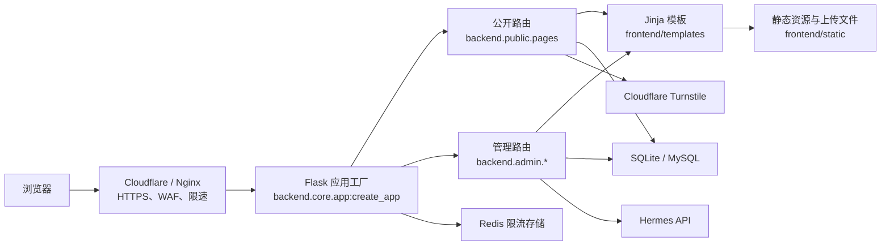
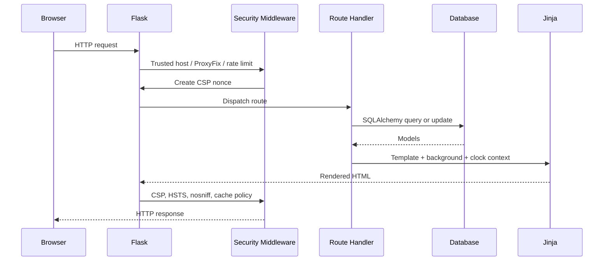
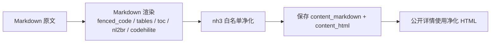
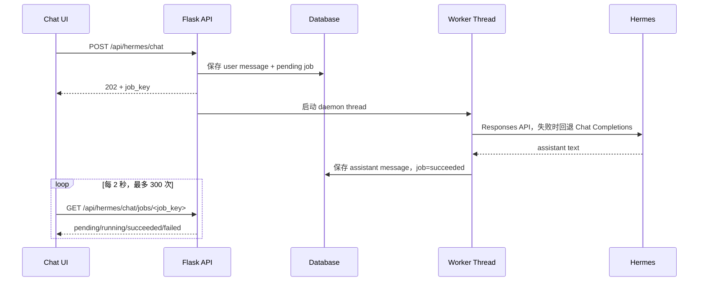

# RainWave 个人网站完整复现与开发说明书

> 文档版本：1.0
> 基准代码日期：2026-07-23
> 基准项目目录：`D:\pycode\开源项目\web flask\web reset`
> 适用对象：软件工程师、UI 工程师、运维工程师、安全工程师，以及负责重建项目的 AI 编程工具
> 目标：让接手者在没有额外口头说明的情况下，完整复现 RainWave 的功能、架构、数据结构、交互、安全策略和视觉效果。

---

## 1. 复现目标与边界

### 1.1 “完整复现”的定义

本项目的完整复现包含四个层级：

1. **功能等价**：公开页面、管理员后台、内容管理、背景设置、时钟、文章、媒体、留言审核和 Hermes AI 功能全部可用。
2. **架构等价**：继续使用 Flask 应用工厂、SQLAlchemy、Jinja 服务端渲染、Bootstrap 基础栅格、原生 JavaScript 增强的结构。
3. **视觉等价**：保持当前夜色电影感、全屏背景、极低填充透明玻璃、全息描边、青紫泛光和响应式布局。
4. **数据等价**：如需连当前文章、日记、媒体、背景和账号一起迁移，必须同时复制数据库与上传目录。

### 1.2 两种复现模式

#### 模式 A：从零搭建同款网站

使用本文档中的模型、路由、页面、样式和配置重新实现。启动后数据库为空，只自动创建表与默认站点设置，需要创建管理员并录入内容。

#### 模式 B：完整迁移当前网站

在模式 A 的代码基础上，同时复制：

- `app.db`，或从原数据库导出的全部业务表；
- `frontend/static/uploads/` 下的背景、图片、音乐和视频；
- `frontend/static/assets/` 下的内置背景、图标和 favicon；
- 生产环境 Secret 与外部服务配置，但不得把 Secret 写入 Git。

仅复制代码而不复制数据库与上传目录，只能得到功能相同的空站，不能得到当前内容完全一致的网站。

---

## 2. 产品定位

RainWave 是一个带内容管理后台的个人博客与数字生活空间。它不是传统白底博客，也不是前后端完全分离的 SPA，而是：

- Flask 服务端渲染的多页面网站；
- 公开内容与管理员私有空间共用一套视觉设计系统；
- 以可更换图片、视频或图片轮播为全屏背景；
- 以极透明玻璃卡片承载正文与后台表单；
- 支持博客文章、日记、图片、音乐、视频、网址、留言和 AI 助手；
- 优先保证个人站点的可维护性、安全性和低部署复杂度。

### 2.1 用户角色

| 角色 | 权限 |
|---|---|
| 游客 | 浏览首页、公开文章、公开网址和已审核留言；提交留言 |
| 已登录普通用户 | 当前代码只保留基础登录能力，登录后仍进入公开首页 |
| 管理员 | 访问个人博客仪表盘、设置中心、文章、日记、媒体、留言审核和 Hermes AI 助手 |

### 2.2 关键设计原则

- 背景是视觉主体，卡片只提供内容分层，不遮死背景。
- 卡片内部不使用明显蓝色填充，主要依赖模糊、描边、阴影和全息边缘区分层级。
- 输入框可以保留轻微底色，因为它需要表达“可输入区域”；普通卡片和按钮应保持无色透明。
- 管理员才能修改站点背景，公开页面不提供手动换背景入口。
- 时钟只显示在公开首页和管理员个人博客首页，避免遮挡其他页面。
- 文章详情保留右侧目录；窄屏下隐藏目录，正文独占宽度。
- 所有危险操作使用 POST、CSRF 和确认提示。

---

## 3. 技术栈

### 3.1 当前已验证环境

- 操作系统：Windows 本地开发，Linux 生产部署优先；
- Python：3.12.3；
- 数据库：本地 SQLite，生产支持 MySQL；
- 浏览器自动化：Chrome + Selenium；
- 前端构建：无 Node.js、无 npm、无打包器。

### 3.2 后端依赖

| 依赖 | 版本 | 用途 |
|---|---:|---|
| Flask | 3.1.3 | Web 框架、路由、模板和请求处理 |
| Flask-SQLAlchemy | 3.1.1 | ORM 与数据库连接 |
| Flask-Login | 0.6.3 | 登录会话 |
| Flask-WTF | 1.2.2 | 表单与 CSRF |
| Flask-Limiter | 4.1.1 | 登录、留言限流 |
| Werkzeug | 3.1.8 | 密码哈希、文件名净化、代理中间件 |
| Markdown | 3.10.2 | Markdown 转 HTML |
| nh3 | 0.3.2 | HTML 白名单净化 |
| Pygments | 2.20.0 | 代码高亮 |
| BeautifulSoup4 | 4.15.0 | HTML 导入清理 |
| html2text | 2025.4.15 | HTML 转 Markdown |
| filetype | 1.2.0 | 上传文件真实类型检测 |
| Pillow | 12.0.0 | 图片解码验证 |
| PyMySQL | 1.1.3 | MySQL 驱动 |
| pyotp | 2.9.0 | 可选管理员 TOTP |
| requests | 2.34.2 | Turnstile 与 Hermes API 请求 |
| Gunicorn | 25.3.0 | Linux 生产 WSGI 服务 |

开发测试额外使用 Selenium 4.38.0。

### 3.3 前端依赖

- Jinja2 模板；
- Bootstrap 5，本地静态文件；
- Bootstrap Icons，本地静态文件；
- 原生 CSS；
- 原生 JavaScript；
- 浏览器原生 `Intl.DateTimeFormat`、`IntersectionObserver`、Web Animations API 和媒体 API。

所有第三方前端资源均从本站 `/static/` 提供，避免运行时依赖公共 CDN，并便于收紧 CSP。

### 3.4 为什么选择该架构

个人博客主要是内容读取和少量管理操作，Flask + Jinja 能够：

- 用较少运行资源完成服务端渲染；
- 默认获得更好的 SEO 和首屏输出；
- 避免额外维护前端 API 项目和 Node 构建链；
- 让表单校验、CSRF、权限和页面渲染保持在同一个安全边界内；
- 通过少量原生 JavaScript 实现动态背景、翻页、目录、下拉框和播放器。

---

## 4. 总体架构



### 4.1 架构性质

本项目采用“代码目录前后端分层、运行时服务端一体化”的架构：

- `backend/` 负责路由、业务逻辑、数据、权限和安全；
- `frontend/` 负责模板、样式、脚本和静态资源；
- 浏览器不会调用一个独立的前端应用；
- 大部分页面由 Flask 直接输出 HTML；
- 只有 Hermes、文件导入等交互使用 JSON API。

### 4.2 请求生命周期



---

## 5. 项目目录

```text
web reset/
├─ backend/
│  ├─ core/
│  │  ├─ app.py            # 应用工厂、扩展初始化、路由注册、全局安全策略
│  │  ├─ config.py         # 环境变量、数据库、Cookie、代理和外部服务配置
│  │  ├─ constants.py      # 背景、字体、媒体、时钟等共享常量
│  │  ├─ forms.py          # WTForms 表单与校验
│  │  └─ models.py         # SQLAlchemy 数据模型
│  ├─ public/
│  │  └─ pages.py          # 首页、文章、网址、留言、SEO 端点
│  └─ admin/
│     ├─ auth.py           # 登录、退出、管理员权限、安全响应头
│     ├─ blog.py           # 博客文章 CRUD、Markdown、导入、公开详情
│     ├─ content.py        # 管理员仪表盘、日记和媒体管理
│     ├─ review.py         # 文章、网址、留言审核与删除
│     ├─ settings.py       # 背景、轮播、时钟、首页文案、初始化和上传校验
│     └─ hermes.py         # AI 对话、任务轮询、写作辅助
├─ frontend/
│  ├─ templates/
│  │  ├─ base.html         # 全局布局、背景、导航、时钟、移动导航
│  │  ├─ public/           # 公开页面
│  │  ├─ admin/            # 管理员页面
│  │  ├─ partials/         # 时钟等局部模板
│  │  └─ _action_macros.html
│  └─ static/
│     ├─ css/rainwave.css
│     ├─ js/rainwave.js
│     ├─ assets/
│     ├─ uploads/
│     │  ├─ backgrounds/
│     │  ├─ images/
│     │  ├─ music/
│     │  └─ videos/
│     └─ vendor/           # 本地 Bootstrap 与 Bootstrap Icons
├─ tests/
├─ docs/
│  └─ images/              # README 最终页面截图
├─ app.db
├─ requirements.txt
├─ requirements-dev.txt
├─ reset_admin_password.py
├─ start_local.ps1
└─ stop_local.ps1
```

### 5.1 重要实现约束

- 路由模块使用 `register_*_routes(app)` 函数注册，不使用 Flask Blueprint。
- 应用入口必须是 `backend.core.app:create_app()`。
- 数据库初始化依赖 `db.create_all()` 和少量启动时字段兼容检查，当前未使用 Alembic。
- 页面应继承 `base.html`，并通过 `render_with_background()` 注入背景和时钟上下文。
- 所有管理页面必须同时使用 `@login_required` 和 `@admin_required`。

---

## 6. 数据模型

### 6.1 模型总表

| 模型 | 表名 | 关键字段 | 用途 |
|---|---|---|---|
| `User` | `user` | username、password_hash、is_admin | 登录账号 |
| `FileRecord` | `file_record` | filename、original_name、file_type、upload_date、user_id | 媒体元数据 |
| `DiaryEntry` | `diary_entry` | title、content、created_at、user_id | 管理员日记 |
| `SiteSetting` | `site_setting` | key、value | 站点 KV 设置 |
| `Article` | `article` | title、content、author_name、is_approved | 旧版/预留游客文章投稿 |
| `Link` | `link` | title、url、description、author_name、is_approved | 公开网址收藏 |
| `Message` | `message` | nickname、content、created_at、is_approved | 留言与审核状态 |
| `BlogPost` | `blog_post` | title、slug、Markdown、HTML、summary、cover、tags、is_published | 正式博客文章 |
| `HermesConversation` | `hermes_conversation` | conversation_key、title、user_id、时间 | AI 会话 |
| `HermesMessage` | `hermes_message` | conversation_id、role、content、时间 | AI 消息 |
| `HermesChatJob` | `hermes_chat_job` | job_key、status、error、关联消息 | 异步 AI 请求状态 |

### 6.2 关键约束

- `User.username` 唯一并建索引。
- 密码只保存 Werkzeug 生成的哈希，不保存明文。
- `BlogPost.slug` 唯一，是公开文章永久链接。
- `BlogPost.content_markdown` 保存原文，`content_html` 保存净化后的渲染结果。
- 草稿由 `is_published=False` 表示，公开查询必须同时过滤 `is_published=True`。
- `SiteSetting.key` 唯一，`value` 使用长文本以容纳 JSON 和介绍文案。
- Hermes 会话只允许当前用户读取，消息随会话级联删除。
- 大部分历史模型只保存 `user_id` 外键，没有完整 ORM relationship；复现时不要擅自改变删除语义。

### 6.3 当前数据快照

基准数据库 `app.db` 当前约 151,552 字节，记录数量如下：

| 表 | 数量 |
|---|---:|
| user | 1 |
| file_record | 2 |
| diary_entry | 1 |
| site_setting | 23 |
| article | 1 |
| link | 0 |
| message | 0 |
| blog_post | 2 |
| hermes_conversation | 0 |
| hermes_message | 0 |
| hermes_chat_job | 0 |

该快照只用于核对迁移是否完整，不应把用户名、密码哈希或私人内容写进公开文档。

### 6.4 当前上传文件快照

| 目录 | 文件数量 | 总大小约 |
|---|---:|---:|
| backgrounds | 8 | 4.3 MB |
| images | 2 | 1.0 MB |
| music | 1 | 83.7 MB |
| videos | 0 | 0 |

数据库 `FileRecord` 只登记普通媒体；背景文件通过 `SiteSetting` 路径引用，不一定存在对应 `FileRecord`。

### 6.5 默认站点设置

每个背景槽位 `home_background`、`blog_background` 都包含：

- `<key>`：静态相对路径；
- `<key>_kind`：`image` 或 `video`；
- `<key>_mime`：MIME；
- `<key>_playlist_enabled`：`0` 或 `1`；
- `<key>_playlist_paths`：JSON 数组；
- `<key>_playlist_interval_seconds`：默认 `15`；
- `<key>_playlist_limit`：默认 `10`。

其他设置：

- `site_clock_style`：`digital`、`text`、`analog`；
- `site_clock_hour_cycle`：`12` 或 `24`；
- `site_clock_show_date`：`0` 或 `1`；
- `homepage_hero_title`；
- `homepage_hero_title_font`；
- `homepage_hero_title_color`；
- `homepage_intro_description`；
- `homepage_intro_description_font`；
- `homepage_intro_description_color`。

默认背景为 `assets/backgrounds/rainwave-hero.jpg`。

---

## 7. 页面与功能规格

## 7.1 公开首页 `/`

必须包含：

- 全屏图片、视频或图片轮播背景；
- 顶部透明导航；
- RAINWAVE 品牌文字；
- 首页、文章、生活、留言四项导航；
- 未登录时显示“登录”；
- 可由管理员配置的主标题、描述、字体和颜色；
- “浏览文章”和“进入留言”入口；
- 最近两篇已发布文章；
- 北京时间组件；
- 桌面页面索引和向下翻页提示；
- 手机底部导航。

首页查询只返回 `is_published=True` 的最近两篇 `BlogPost`。

## 7.2 文章列表 `/articles`

- 每页 6 篇已发布文章；
- 按创建时间倒序；
- 桌面首屏展示前三张重点卡片；
- 第一张为 featured 大卡；
- 显示标题、摘要、日期、首个标签和估算阅读时间；
- 多页时显示分页；
- 手机端只突出第一张卡片。

## 7.3 文章详情 `/blog/post/<slug>`

- 只允许访问已发布文章；
- 左侧/主体为可滚动透明文章卡；
- 显示标题、日期、阅读时间和标签；
- 输出保存时生成并经 nh3 白名单净化的 HTML；
- 右侧目录由 JavaScript 扫描正文 `h2`、`h3` 自动生成；
- 目录当前项由 `IntersectionObserver` 更新；
- 点击目录平滑滚动；
- 宽度不超过 980 px 时隐藏目录；
- 草稿 slug 必须返回 404。

## 7.4 生活/网址 `/links`

- 数据来自 `Link`；
- 只显示 `is_approved=True`；
- 每页 9 条，按创建时间倒序；
- 外链使用新窗口，并设置 `rel="noopener noreferrer"`；
- 显示标题、描述、提交者与日期。

导航文案是“生活”，底层路由和模型仍叫 `links`。

## 7.5 留言 `/messages`

- GET 显示已审核留言，每页 12 条；
- POST 创建 `is_approved=False` 的留言；
- 昵称最长 80 字符；
- 内容最长 1000 字符；
- 使用 CSRF；
- 使用隐藏 `website` 蜜罐字段；
- 配置 Turnstile 后必须验证成功；
- 提交后重定向，显示等待审核提示；
- 路由限流为每 IP 每小时 3 次。

## 7.6 管理员登录 `/login`

- 用户名和密码必填；
- 配置 `ADMIN_TOTP_SECRET` 后额外验证动态码；
- 登录成功前执行 `session.clear()`，防止会话固定；
- 管理员进入 `/blog`；
- 登录限流：每分钟 5 次、每小时 20 次；
- 已登录管理员重复访问登录页时直接进入仪表盘；
- 退出必须 POST `/logout` 并携带 CSRF。

## 7.7 管理员个人博客 `/blog`

这是管理员首页，必须展示：

- 个人博客主视觉卡；
- 北京时间，嵌入主视觉右侧；
- 博客、日记、音乐、图片、视频统计；
- 最近 5 篇博客文章；
- 日记、音乐、图片和视频内容区；
- Hermes Agent 入口；
- 每个模块进入对应管理页面；
- 顶部管理员快捷入口和账户下拉菜单。

时钟只应出现在公开首页 `/` 与管理员个人博客 `/blog`，不应出现在设置、文章编辑、聊天或媒体管理页。

## 7.8 设置中心 `/admin`

页面采用左侧目录、右侧单面板结构。URL hash 应能直接打开指定面板。

### 面板 1：单个背景

- 目标：`home_background` 或 `blog_background`；
- 可上传本地图片或视频；
- 可从服务器已有背景中选择；
- 选择后立即预览；
- 保存单个背景时关闭该目标的轮播；
- 显示文件类型、来源和缩略图；
- 公开页面不显示背景切换控件。

### 面板 2：文件夹轮播背景

- 仅支持图片；
- 使用多文件/文件夹选择；
- 切换间隔 1–3600 秒；
- 参与轮播数量 1–500；
- 新上传文件夹替换当前轮播文件列表；
- 前端在用户未开启“减少动态效果”时自动交叉淡入；
- 设置只影响选中的首页或博客背景槽位。

### 面板 3：顶部时间组件

- 数字、文字、模拟钟三种样式；
- 12/24 小时制；
- 日期显示/隐藏；
- 固定使用 `Asia/Shanghai`；
- 每秒刷新。

### 面板 4：首页个性描述

- 首页欢迎语；
- 欢迎语字体与颜色；
- 首页描述；
- 描述字体与颜色；
- 字体必须从白名单选择；
- 颜色必须规范化为六位十六进制。

### 面板 5：当前背景状态

- 同时显示首页和博客背景；
- 支持图片或视频预览；
- 显示当前是单图、单视频还是轮播；
- 轮播时显示数量和间隔。

### 面板 6：留言审核

- 显示待审核、已通过和总数；
- 未审核留言可通过；
- 所有留言可删除；
- 操作使用 POST + CSRF；
- 删除操作带确认提示。

### 设置页快捷入口

页面顶部提供文章、日记、音乐、图片、视频和 AI 助手六个胶囊按钮。

## 7.9 博客管理

### `/manage/blog`

- 查看全部文章，包括草稿；
- 显示总数、已发布数、草稿数；
- 查看封面、摘要、标签、状态和时间；
- 新建、编辑、预览、删除。

### `/manage/blog/new`

- 标题；
- 可选 slug；
- Markdown 正文；
- 摘要；
- 可选封面；
- 逗号分隔标签；
- 发布/草稿状态；
- Markdown 实时简化预览；
- 从 `.md`、`.markdown`、`.txt`、`.html`、`.htm` 导入；
- Hermes 润色、扩写、总结、翻译。

### `/manage/blog/edit/<id>`

与新建页相同，回填现有内容。修改 slug 时必须继续保证唯一。

### Markdown 保存流程



允许的 HTML 标签包括标题、段落、列表、表格、代码、链接、图片和基础强调标签；脚本、事件属性、危险 URL scheme 必须被移除。

## 7.10 日记管理 `/manage/diaries`

- 创建标题与正文；
- 标题最大 120 字符；
- 按时间倒序展示；
- 删除使用 POST + CSRF + 确认；
- 当前日记只在管理员个人博客中显示，没有公开日记详情路由。

## 7.11 媒体管理

共用 `admin/manage_media.html`：

| 页面 | 类型 | 目录 |
|---|---|---|
| `/manage/images` | image | `uploads/images` |
| `/manage/music` | music | `uploads/music` |
| `/manage/videos` | video | `uploads/videos` |

功能：

- 上传；
- 上传前本地预览；
- 现有媒体列表；
- 图片缩略图；
- 视频播放；
- 自定义音乐播放器；
- 删除物理文件和数据库记录；
- 空状态提示。

## 7.12 Hermes AI 助手

### 页面 `/chat`

- 左侧会话历史；
- 新建会话；
- 加载历史消息；
- 发送消息；
- 输入框自动增高；
- 后台任务状态轮询；
- 默认加载最新会话。

### 对话流程



### API 行为

- 消息最大 2000 字符；
- 本地未配置 Hermes 时返回 Mock；
- 首选 OpenAI Responses 风格 `/responses`；
- 失败时回退 Chat Completions；
- 外部请求超时 120–180 秒；
- 历史回退最多保留 6 条清理后的消息；
- 会话与任务必须按 `current_user.id` 隔离。

### 写作辅助

`POST /api/hermes/writing-assist` 支持：

- `polish`；
- `expand`；
- `summarize`；
- `translate`。

输入最大 5000 字符。

### 当前实现限制

后台任务使用 Gunicorn worker 内部的 daemon thread，不是持久任务队列。若 worker 重启，运行中的任务会丢失。要扩展成高可用版本，应替换为 Celery/RQ + Redis，但如果目标是精确复现当前项目，不要擅自改变协议和前端轮询行为。

---

## 8. 路由清单

当前 URL map 共 36 条规则，其中 35 条应用规则和 1 条 Flask 静态规则。

| 方法 | 路径 | 权限 | 功能 |
|---|---|---|---|
| GET | `/` | 公开 | 首页 |
| GET | `/articles` | 公开 | 已发布文章列表 |
| GET | `/blog/post/<slug>` | 公开 | 已发布文章详情 |
| GET | `/links` | 公开 | 已审核网址 |
| GET/POST | `/messages` | 公开 | 留言列表与提交 |
| GET/POST | `/login` | 公开 | 登录 |
| POST | `/logout` | 登录 | 退出 |
| GET | `/blog` | 管理员 | 个人博客仪表盘 |
| GET/POST | `/admin` | 管理员 | 设置中心 |
| GET | `/manage/blog` | 管理员 | 文章管理 |
| GET/POST | `/manage/blog/new` | 管理员 | 新建文章 |
| GET/POST | `/manage/blog/edit/<post_id>` | 管理员 | 编辑文章 |
| POST | `/manage/blog/delete/<post_id>` | 管理员 | 删除文章 |
| GET/POST | `/manage/diaries` | 管理员 | 日记管理 |
| GET/POST | `/manage/images` | 管理员 | 图片管理 |
| GET/POST | `/manage/music` | 管理员 | 音乐管理 |
| GET/POST | `/manage/videos` | 管理员 | 视频管理 |
| POST | `/delete/<file_id>` | 管理员 | 删除媒体 |
| POST | `/delete-diary/<entry_id>` | 管理员 | 删除日记 |
| POST | `/approve-article/<article_id>` | 管理员 | 审核旧版文章投稿 |
| POST | `/approve-link/<link_id>` | 管理员 | 审核旧版网址投稿 |
| POST | `/approve-message/<message_id>` | 管理员 | 审核留言 |
| POST | `/delete-article/<article_id>` | 管理员 | 删除旧版文章投稿 |
| POST | `/delete-link/<link_id>` | 管理员 | 删除网址 |
| POST | `/delete-message/<message_id>` | 管理员 | 删除留言 |
| GET | `/chat` | 管理员 | Hermes 页面 |
| GET/POST | `/api/hermes/conversations` | 管理员 | 列出/创建会话 |
| GET | `/api/hermes/conversations/<id>/messages` | 管理员 | 会话消息 |
| POST | `/api/hermes/chat` | 管理员 | 提交 AI 任务 |
| GET | `/api/hermes/chat/jobs/<job_key>` | 管理员 | 轮询任务 |
| POST | `/api/hermes/writing-assist` | 管理员 | 写作辅助 |
| POST | `/api/import-file` | 管理员 | 导入文章文件 |
| GET | `/sitemap.xml` | 公开 | SEO Sitemap |
| GET | `/robots.txt` | 公开 | 爬虫规则 |
| GET | `/favicon.ico` | 公开 | 站点图标 |
| GET | `/static/<path>` | 公开 | Flask 静态资源 |

### 8.1 遗留功能说明

`Article`、`Link` 的审核和删除路由仍存在，但当前公开 UI 没有文章投稿或网址投稿表单；当前 `/articles` 展示的是 `BlogPost`，设置中心审核 UI 只展示 `Message`。复现时应保留这些模型和路由以兼容旧数据，但不要误写成当前游客可见功能。

---

## 9. 背景与媒体系统

### 9.1 背景渲染

`render_with_background(template, setting_key, **context)` 是全站共用入口，负责注入：

- `background_asset`；
- 最多三个 `background_choices`；
- `clock_settings`；
- `current_endpoint`。

`base.html` 根据背景类型输出 `` 或 `<video>`。轮播时输出多个 `.rw-background` 层，JavaScript 通过 `.is-active` 改变透明度。

### 9.2 背景优先级

1. 轮播已开启且存在有效图片；
2. 单个已配置背景；
3. 默认 `assets/backgrounds/rainwave-hero.jpg`。

路径只允许：

- `uploads/backgrounds/`；
- `assets/backgrounds/`。

必须拒绝 `..` 路径穿越，并校验解析后的绝对路径仍在 static 根目录下。

### 9.3 上传限制

| 分类 | 单文件上限 | MIME |
|---|---:|---|
| images | 12 MB | JPEG、PNG、WebP、GIF |
| backgrounds | 200 MB | 上述图片 + MP4、WebM、QuickTime |
| videos | 200 MB | MP4、WebM、QuickTime |
| music | 100 MB | MP3、FLAC、OGG、WAV、MP4 Audio |

全局请求上限为 220 MB。

### 9.4 上传安全流程

1. `secure_filename()` 清理原始文件名；
2. 基础名限制在 90 字符以内；
3. 读取真实字节长度；
4. 使用 `filetype.guess()` 检测真实 MIME；
5. MIME 必须属于目标目录白名单；
6. 图片使用 Pillow `verify()` 解码验证；
7. 根据检测到的类型决定扩展名；
8. 使用 UUID 随机文件名；
9. 保存到固定上传目录；
10. 普通媒体写入 `FileRecord`。

不得只根据浏览器上传的扩展名或 `Content-Type` 判断类型。

---

## 10. UI 设计系统

## 10.1 视觉关键词

- 夜色电影感；
- 全屏人物或场景背景；
- 超透明玻璃；
- 青色、紫色、低饱和粉色全息边缘；
- 白色正文与低对比度蓝灰辅助文字；
- 胶囊按钮；
- 大标题；
- 轻泛光，不使用大面积实色渐变填充。

## 10.2 核心设计令牌

```css
:root {
  --rw-ink: #f7f9ff;
  --rw-muted: rgba(225, 234, 247, 0.68);
  --rw-dim: rgba(216, 228, 244, 0.48);
  --rw-line: rgba(209, 234, 255, 0.33);
  --rw-deep: #061323;
  --rw-glow: #7ed4ff;
  --rw-violet: #b38dff;
  --rw-pink: #ffb7df;
  --rw-card-glass: rgba(255, 255, 255, 0.012);
  --rw-liquid: var(--rw-card-glass);
  --rw-liquid-hover: rgba(255, 255, 255, 0.04);
  --rw-liquid-popover: var(--rw-card-glass);
  --rw-field-glass: rgba(208, 232, 255, 0.065);
  --rw-liquid-line: rgba(190, 226, 255, 0.26);
  --rw-liquid-line-strong: rgba(153, 220, 255, 0.56);
}
```

### 10.3 材质规则

#### 普通卡片

- 背景：`rgba(255,255,255,0.012)`；
- 模糊：约 6–9 px；
- 饱和度：126%；
- 不使用淡蓝实色填充；
- 使用内侧白色高光与低透明黑色阴影；
- 左侧青色、右侧紫色的轻微环境泛光。

#### 全息边缘

使用 1 px masked pseudo-element 描边，颜色顺序：

1. 亮青；
2. 低透明白；
3. 紫；
4. 粉；
5. 青。

渐变只允许用于边缘和极弱内层光，不允许成为卡片主体填充。

#### 输入框

- 背景：`--rw-field-glass`；
- 最小高度 48 px；
- 圆角 13–15 px；
- 焦点边框亮青；
- 焦点外发光透明度低；
- 输入区域可以比普通卡片稍明显。

#### 下拉框

- 原生 `<select>` 保留为表单值源，但视觉隐藏；
- 自定义 trigger 高 48 px；
- 菜单模糊 48 px；
- 菜单圆角 18 px；
- 选项高 45 px，圆角 13 px，间距 8 px；
- 选项内部透明，仅有描边；
- 选中项显示亮青描边、勾选和轻微泛光；
- 展开时必须预留实际菜单高度，不能覆盖下一个字段。

#### 管理员账户菜单

- 宽 232 px；
- 外层圆角 20 px；
- 模糊 42 px；
- 每项最小高 43 px；
- 每项独立胶囊描边；
- 退出登录使用低饱和粉色文字和粉色边框；
- 不使用黑色实底。

#### 音频播放器

- 自定义播放/暂停、时间、进度和静音；
- 玩家圆角 18 px；
- 普通卡片透明度；
- 圆形控制按钮 42 × 42 px；
- 当前进度青白色；
- 播放一首时暂停其他音频。

## 10.4 背景视觉层

从后到前：

1. 背景图片/视频；
2. 深色横向和纵向 veil；
3. 右上青白径向光；
4. 右下紫色径向光；
5. 应用内容。

背景图片：

- `object-fit: cover`；
- `object-position: 58% center`；
- 轻微降低饱和度并提高对比度。

背景切换使用 900 ms opacity 过渡。

## 10.5 顶部导航

桌面：

- 页面外边距 30–36 px；
- 高度 64 px；
- 圆角 18 px；
- 三列：品牌、导航、账户；
- 品牌使用 Georgia，字间距 0.42em；
- 当前导航底部显示 5 px 发光圆点；
- 背景与普通卡片同为低填充透明玻璃。

管理员模式：

- 品牌 + 小型公开导航 + 右侧快捷入口；
- 右侧包含个人博客、AI 助手和管理员菜单。

手机：

- 顶栏高 58 px；
- 隐藏桌面导航；
- 底部显示固定导航；
- 管理员用户名视觉隐藏，仅保留头像按钮。

## 10.6 首页排版

- 主内容左对齐；
- 首页标题宽度不超过 710 px；
- 桌面标题 `clamp(48px, 4.3vw, 64px)`；
- 手机标题 `clamp(34px, 9.2vw, 40px)`；
- 描述桌面 17 px、行高 2；
- 右侧保留背景主体；
- 最近文章条位于左下方；
- 首页时钟位于导航下方右侧，不带外层卡片。

## 10.7 文章详情

- 桌面两列：正文 `1fr` + 250–310 px 目录；
- 间距 22 px；
- 总高约 `100vh - 155px`；
- 正文独立滚动；
- 正文卡顶部圆角 24 px；
- 目录圆角 22 px；
- 目录当前项左侧青色内线。

## 10.8 响应式断点

| 断点 | 行为 |
|---:|---|
| 1100 px | 管理员顶部公开导航隐藏；卡片网格降为两列 |
| 980 px | 页面外边距收紧；文章目录隐藏；正文单列 |
| 680 px | 启用手机布局、底部导航、单列卡片和紧凑管理员布局 |
| 540 px | 管理员按钮只保留图标；快捷卡片单列；文件选择器单列 |

用户启用 `prefers-reduced-motion: reduce` 时，动画和过渡必须近似关闭，背景轮播也不自动执行。

## 10.9 可访问性

- 页面必须有“跳到主要内容”链接；
- 当前导航使用 `aria-current`；
- 图标装饰使用 `aria-hidden`；
- 自定义下拉框使用 combobox/listbox/option 角色；
- 下拉框支持方向键、Home、End、Enter、Space、Escape；
- 自定义播放器按钮动态更新 `aria-label`；
- range 进度条保留键盘操作；
- flash 使用 `role="status"` 和 `aria-live`；
- 焦点必须可见；
- 触摸和键盘操作不能依赖 hover。

---

## 11. 前端交互规范

所有全局增强在 `frontend/static/js/rainwave.js` 中，以一个 IIFE 执行。

### 11.1 页面切换

- 同源普通链接点击后添加 `body.is-leaving`；
- 360 ms 后跳转；
- 新窗口、下载、修饰键点击不拦截；
- 减少动态效果时立即跳转。

### 11.2 翻页

- `ArrowRight`、`PageDown` 进入下一栏目；
- 首页、文章、生活页向下滚动超过 80 时进入下一页；
- 滚轮锁 900 ms；
- 正文滚动区和留言列表内滚动不触发翻页；
- 手机左滑超过 80 px 进入下一页。

### 11.3 背景轮播

- 读取 `data-background-interval`；
- 最低间隔 1 秒；
- 激活视频时播放，离开时暂停；
- 减少动态效果时不自动轮播。

### 11.4 自定义文件选择器

管理员页面自动寻找原生 file input，包装成：

- 浏览/选择按钮；
- 当前文件名；
- 多文件时显示数量；
- 支持普通、紧凑和文件夹模式；
- 原生 input 仍负责提交与焦点。

### 11.5 自定义下拉框

- 原生 select 是唯一真实值源；
- JS 生成 trigger、menu 和 option button；
- 选择后触发原生 `change`；
- 表单 reset 后重新同步；
- 点击外部和 Escape 关闭；
- resize 时重新计算菜单占位高度。

### 11.6 时钟

- 时区固定 `Asia/Shanghai`；
- 使用 `Intl.DateTimeFormat`；
- 每秒更新；
- 模拟钟动态计算时、分、秒针角度；
- 日期格式为中文年月日与星期。

### 11.7 文章目录

- 扫描 `h2`、`h3`；
- 无 ID 时生成 `article-heading-N`；
- 无标题时显示空状态；
- 平滑滚动并更新 URL hash；
- 使用正文滚动容器作为 IntersectionObserver root。

---

## 12. 安全架构

## 12.1 身份与权限

- Flask-Login 管理会话；
- 管理路由必须 `login_required` + `admin_required`；
- 密码使用 Werkzeug 哈希；
- 登录成功清空旧 Session；
- 可选 TOTP，允许一个时间窗口偏差；
- 安全的 `next` 只允许以 `/` 开头的本站相对路径；
- 退出必须 POST。

## 12.2 CSRF

- Flask-WTF 全局启用；
- HTML 表单输出隐藏 token；
- JSON/Fetch 请求使用 `X-CSRFToken`；
- 删除、审核、退出均不允许 GET。

## 12.3 Cookie

生产环境：

- `Secure=True`；
- `HttpOnly=True`；
- `SameSite=Lax`；
- Session 名为 `__Host-rainwave_session`；
- 有效期 12 小时。

本地开发使用 `rainwave_session` 且允许 HTTP。

## 12.4 CSP 与安全响应头

必须输出：

- `Content-Security-Policy`；
- `X-Content-Type-Options: nosniff`；
- `X-Frame-Options: SAMEORIGIN`；
- `Referrer-Policy: strict-origin-when-cross-origin`；
- `Permissions-Policy` 禁用摄像头、麦克风、地理位置和 browsing-topics；
- `Cross-Origin-Opener-Policy: same-origin`；
- `Cross-Origin-Resource-Policy: same-origin`；
- HTTPS 时输出一年 HSTS，并包含子域。

CSP：

- 默认只允许 `'self'`；
- script 使用每请求 nonce；
- style 当前允许 `'unsafe-inline'`，因为多个模板仍有内联样式；
- 图片允许 self、data、blob；
- 媒体允许 self、blob；
- iframe 默认 self；
- Turnstile 启用时单独加入 Cloudflare 域；
- 生产启用 `upgrade-insecure-requests`。

## 12.5 内容安全

- Markdown 先渲染，再用 nh3 白名单净化；
- 公开文章查询强制 `is_published=True`；
- 外链增加 `noopener noreferrer`；
- 模板只有净化后的文章 HTML使用 `|safe`；
- 普通用户内容依赖 Jinja 自动转义。

## 12.6 请求与上传限制

- `MAX_CONTENT_LENGTH = 220 MB`；
- `MAX_FORM_MEMORY_SIZE = 512 KB`；
- `MAX_FORM_PARTS = 64`；
- 文件同时检查大小、真实签名、MIME、图片解码和路径；
- 上传文件随机命名；
- 不允许上传 SVG 作为普通图片，避免脚本型 SVG 风险；
- 上传目录只保存媒体，不允许代码执行。

## 12.7 限流与反垃圾

- 登录：5/分钟、20/小时；
- 留言：3/小时；
- 生产必须使用 Redis 存储限流状态；
- 留言包含蜜罐；
- 可选 Turnstile；
- 反向代理应补充连接速率、请求体和异常 User-Agent 策略。

## 12.8 可信主机和代理

- Flask `TRUSTED_HOSTS` 限制 Host；
- 生产默认信任 `rainwave.top` 和 `www.rainwave.top`；
- 本地默认 `127.0.0.1` 和 `localhost`；
- 只在可信反向代理之后启用 ProxyFix；
- `PROXY_FIX_X_FOR/X_PROTO/X_HOST` 必须与代理层数一致。

## 12.9 缓存

- `/static/`：默认缓存 7 天；
- `/login`、`/admin`、`/manage`、`/api`：`no-store`；
- 页面 HTML 不应被共享缓存保存管理员内容。

## 12.10 反爬能力与真实边界

当前项目提供：

- `robots.txt` 禁止 `/admin`、`/manage`、`/api`；
- Sitemap 只列公开页面和已发布文章；
- 登录和留言限流；
- 可选 Cloudflare WAF、Bot Management 和 Turnstile；
- 管理页面认证；
- 草稿隔离。

必须明确：公开网页只要浏览器可以读取，就无法从技术上绝对禁止抓取或复制。反爬的合理目标是提高批量抓取成本、保护后台、限制滥用和减少自动垃圾内容，而不是承诺“完全不可爬”。

## 12.11 当前安全限制

- 未实现登录失败账号锁定；
- 未集成依赖漏洞自动扫描；
- 未使用独立对象存储；
- Hermes 后台任务不是持久队列；
- 没有 Alembic 版本化迁移；
- 内联 CSS 使 CSP 仍需要 `style-src 'unsafe-inline'`。

这些限制应在生产部署计划中评估，但不能为了“复现”随意改变现有业务行为。

---

## 13. 环境变量

| 变量 | 必需性 | 说明 |
|---|---|---|
| `LOCAL_DEV` | 本地 | `1` 时启用本地模式 |
| `FLASK_DEBUG` | 本地可选 | 调试模式 |
| `FLASK_AUTO_RELOAD` | 本地可选 | 自动重载 |
| `FLASK_RUN_HOST` | 可选 | 默认 127.0.0.1 |
| `FLASK_RUN_PORT` | 可选 | 默认 5000 |
| `SECRET_KEY` | 生产必需 | 至少 32 字符，不得使用占位值 |
| `DATABASE_URL` | 生产推荐 | 完整 SQLAlchemy URI |
| `MYSQL_HOST` | 二选一 | 不使用 DATABASE_URL 时组合 MySQL URI |
| `MYSQL_PORT` | 可选 | 默认 3306 |
| `MYSQL_USER` | 二选一 | 禁止使用 root |
| `MYSQL_PASSWORD` | 二选一 | 数据库密码 |
| `MYSQL_DB` | 二选一 | 数据库名 |
| `ALLOW_ROOT_DATABASE_USER` | 临时调试 | 不建议生产启用 |
| `TRUSTED_HOSTS` | 生产必需 | 逗号分隔域名 |
| `RATELIMIT_STORAGE_URI` | 生产必需 | 建议 Redis |
| `TURNSTILE_SITE_KEY` | 可选 | 留言验证码 |
| `TURNSTILE_SECRET_KEY` | 可选 | 留言验证码服务端 Secret |
| `ADMIN_TOTP_SECRET` | 可选加强 | Base32 TOTP Secret |
| `PROXY_FIX_ENABLED` | 生产 | 反向代理之后启用 |
| `PROXY_FIX_X_FOR` | 可选 | 默认 1 |
| `PROXY_FIX_X_PROTO` | 可选 | 默认 1 |
| `PROXY_FIX_X_HOST` | 可选 | 默认 1 |
| `INIT_ADMIN_USERNAME` | 首次部署可选 | 与密码同时设置 |
| `INIT_ADMIN_PASSWORD` | 首次部署可选 | 至少 12 字符 |
| `HERMES_API_URL` | 可选 | OpenAI 兼容 Hermes 地址 |
| `HERMES_API_KEY` | 可选 | Hermes API Key |

本地未提供 `SECRET_KEY` 时会生成 `.local-dev-secret-key`。该文件不能提交或分享；重新生成只会使旧 Session 失效，不影响业务数据。

---

## 14. 本地复现步骤

### 14.1 环境准备

建议安装 Python 3.12、Chrome 和 Git。

```powershell
cd "D:\pycode\开源项目\web flask\web reset"
python -m venv .venv
.\.venv\Scripts\python.exe -m pip install --upgrade pip
.\.venv\Scripts\python.exe -m pip install -r requirements-dev.txt
```

### 14.2 创建管理员

```powershell
.\.venv\Scripts\python.exe reset_admin_password.py `
  --username admin `
  --password "替换为高强度密码" `
  --create-if-missing
```

如果当前 PowerShell 位于上一级 `D:\pycode\开源项目\web flask`，必须先进入 `web reset`，否则 `.\.venv\Scripts\python.exe` 指向错误目录。

### 14.3 启动

```powershell
.\start_local.ps1
```

打开：

- 前台：`http://127.0.0.1:5000/`
- 登录：`http://127.0.0.1:5000/login`
- 管理员设置：`http://127.0.0.1:5000/admin`

### 14.4 停止

```powershell
.\stop_local.ps1
```

停止脚本只定位当前项目虚拟环境和 5000 端口相关 Python 进程，避免误杀其他 Python 服务。

### 14.5 初始化行为

首次启动会：

1. 创建上传目录；
2. `db.create_all()` 创建缺少的数据表；
3. 检查密码哈希与设置值列容量；
4. 写入 23 项默认设置；
5. 可选创建环境变量指定的管理员；
6. 修正失效背景路径。

---

## 15. 当前内容的精确迁移

### 15.1 SQLite 到 SQLite

停止源站后复制：

```text
app.db
frontend/static/uploads/
frontend/static/assets/
```

然后在目标机：

1. 安装相同依赖；
2. 放回相同相对目录；
3. 生成新的 `SECRET_KEY`；
4. 启动并执行测试；
5. 重置管理员密码。

不要复制 `.local-dev-secret-key` 到生产环境。

### 15.2 SQLite 到 MySQL

目标数据库必须使用 `utf8mb4`。推荐流程：

1. 在 MySQL 创建独立低权限用户和数据库；
2. 先用当前模型创建空表；
3. 按主键顺序导出并导入所有业务表；
4. 保留时间、布尔值、slug 和外键；
5. 复制上传目录；
6. 设置 `DATABASE_URL`；
7. 核对表记录数和站点设置；
8. 执行全量测试。

### 15.3 必须核对的迁移项

- 11 张业务表；
- 23 项 `SiteSetting`；
- `BlogPost.slug` 不重复；
- 管理员密码哈希字段未截断；
- 背景设置中的相对路径都存在；
- `FileRecord` 对应物理文件存在；
- 音乐大文件未被同步工具忽略；
- 上传目录不可执行；
- 所有 Secret 已更换。

---

## 16. 生产部署参考

### 16.1 推荐拓扑

```text
Internet
  -> Cloudflare
  -> Nginx :443
  -> Gunicorn 127.0.0.1:8000
  -> Flask
  -> MySQL + Redis
```

### 16.2 最小生产环境

```text
SECRET_KEY=<至少32字符随机值>
DATABASE_URL=mysql+pymysql://rainwave_app:<password>@127.0.0.1:3306/rainwave?charset=utf8mb4
TRUSTED_HOSTS=rainwave.top,www.rainwave.top
RATELIMIT_STORAGE_URI=redis://127.0.0.1:6379/0
PROXY_FIX_ENABLED=true
```

### 16.3 Gunicorn

```bash
gunicorn \
  --workers 2 \
  --bind 127.0.0.1:8000 \
  --access-logfile - \
  --error-logfile - \
  "backend.core.app:create_app()"
```

### 16.4 Nginx 核心要求

- 强制 HTTPS；
- 只允许 Nginx 访问 Gunicorn；
- 设置真实 IP、Host 和协议头；
- 请求体上限至少与 Flask 保持一致；
- `/static/` 可长期缓存；
- 管理和 API 页面禁止代理缓存；
- 上传目录固定正确 MIME，禁止脚本执行；
- 增加连接速率、请求速率和超时限制。

示意配置：

```nginx
server {
    listen 443 ssl http2;
    server_name rainwave.top www.rainwave.top;

    client_max_body_size 220m;

    location /static/ {
        alias /srv/rainwave/frontend/static/;
        expires 7d;
        add_header X-Content-Type-Options nosniff always;
    }

    location / {
        proxy_pass http://127.0.0.1:8000;
        proxy_set_header Host $host;
        proxy_set_header X-Real-IP $remote_addr;
        proxy_set_header X-Forwarded-For $proxy_add_x_forwarded_for;
        proxy_set_header X-Forwarded-Proto $scheme;
    }
}
```

生产证书路径、Cloudflare 真实 IP 还原和安全策略需根据实际服务器补充。

### 16.5 数据与媒体备份

至少备份：

- MySQL 每日逻辑备份；
- `frontend/static/uploads/`；
- 生产环境变量或 Secret Manager 配置；
- 当前代码版本；
- 恢复演练记录。

上传文件较多后建议迁移到私有对象存储，并使用独立上传域名和服务端签名 URL。若这样改造，仍要保留当前路径结构或提供兼容层。

---

## 17. 测试与验收

### 17.1 基础命令

```powershell
.\.venv\Scripts\python.exe -m unittest discover -s tests -v
.\.venv\Scripts\python.exe -m pip check
$env:RAINWAVE_BASE_URL = "http://127.0.0.1:5000"
.\.venv\Scripts\python.exe tests\capture_readme_screenshots.py
```

当前基准：

- 34 项单元、性能回归与安全测试通过；
- `pip check` 无依赖冲突；
- 公开页面桌面和 390 × 844 手机视觉测试通过；
- 管理员桌面和手机视觉测试通过；
- 无严重浏览器控制台错误。

### 17.2 单元测试必须覆盖

- 设置页两列等高与单背景工作区；
- 管理入口和所有管理员页面可渲染；
- 时钟只出现在首页和管理员仪表盘；
- 公开页面没有换背景入口；
- 文章目录存在；
- 背景轮播层正确输出；
- 文件选择器和音乐播放器正确增强；
- 图片上传真实格式校验；
- 时钟设置更新；
- 日记创建与删除；
- 背景库选择；
- 草稿不可公开；
- Markdown 白名单净化；
- CSP 不允许 unsafe inline script；
- 假图片上传被拒绝；
- Hermes 历史、会话键、响应解析和任务状态。

### 17.3 视觉验收视口

- 公开桌面：1422 × 872；
- 管理员桌面：1725 × 900；
- 手机：390 × 844；
- 可额外检查 1366 × 768、1920 × 1080 和 Safari/iOS。

### 17.4 UI 验收重点

- 顶部导航与主要卡片不应出现明显淡蓝填充；
- 背景人物或场景仍可透过卡片；
- 文字在明暗背景上可读；
- 下拉菜单内容不会与背景文字混在一起；
- 下拉菜单不会覆盖后一个字段；
- 管理员菜单每项独立描边；
- 退出登录为粉色语义；
- 音频控件不是浏览器黑灰原生条；
- 文章目录与正文滚动同步；
- 手机无水平滚动；
- 减少动态效果设置生效。

### 17.5 功能验收清单

- [ ] 首页、文章、生活、留言全部 200；
- [ ] 草稿详情返回 404；
- [ ] 登录失败和成功行为正确；
- [ ] 管理员路由未登录时重定向；
- [ ] 创建、编辑、删除文章；
- [ ] 创建、删除日记；
- [ ] 上传、预览、删除三类媒体；
- [ ] 上传假图片被拒绝；
- [ ] 设置首页与博客单背景；
- [ ] 设置图片轮播；
- [ ] 设置三种时钟；
- [ ] 设置首页标题与描述；
- [ ] 留言提交后等待审核；
- [ ] 管理员审核和删除留言；
- [ ] Hermes Mock 与真实 API 模式；
- [ ] Sitemap 不包含草稿；
- [ ] robots 禁止后台路径；
- [ ] CSP、Cookie、HSTS 和缓存头符合环境。

---

## 18. 关键视觉参考

文档接收者应把以下浏览器截图作为视觉真值，而不是只根据文字自由发挥：

- 公开首页：`images/home-desktop.webp`
- 移动端首页：`images/home-mobile.webp`
- 文章列表：`images/articles-desktop.webp`
- 文章目录：`images/article-detail-desktop.webp`
- 管理员仪表盘：`images/admin-dashboard.webp`
- 设置中心：`images/admin-settings.webp`
- AI 助手：`images/admin-chat.webp`

这些图片由 `tests/capture_readme_screenshots.py` 从当前实现直接生成。

---

## 19. 推荐开发顺序

1. 建立 Flask 应用工厂与配置；
2. 定义全部模型并初始化数据库；
3. 实现登录、管理员权限、CSRF 与安全头；
4. 实现 `SiteSetting`、背景解析和统一渲染函数；
5. 完成 `base.html` 与公开页面；
6. 完成博客文章 CRUD、Markdown 和目录；
7. 完成日记、媒体和留言审核；
8. 完成设置中心；
9. 完成 Hermes API 与聊天 UI；
10. 实现全局 CSS 设计系统；
11. 实现背景、翻页、下拉框、文件选择器、时钟、目录和音频增强；
12. 补齐测试；
13. 进行桌面、手机和安全验收；
14. 最后迁移真实数据和媒体。

不要先堆 UI 再补权限和数据，也不要先导入真实数据再验证上传与草稿隔离。

---

## 20. 一体化重建提示词

下面的提示词可以直接交给具备文件读写、终端和浏览器能力的 AI 编程工具。若目标目录中已经有本项目代码，应要求它以代码为准做增量修复；若目录为空，可从零生成。

```text
你是一名资深 Python Web 架构师、Flask 工程师、前端 UI 工程师、
数据库工程师和 Web 安全工程师。请从零构建一个名为 RainWave 的个人博客与
内容管理网站，并严格遵循下面的规格。不要把它改造成 React/Vue SPA，不要引入
Node 构建链，不要使用公共 CDN，不要用演示假按钮代替真实功能。

一、技术架构
1. 使用 Python 3.12、Flask 3.1、Flask-SQLAlchemy、Flask-Login、
   Flask-WTF、Flask-Limiter。
2. 使用 Flask 应用工厂 create_app()，入口为 backend.core.app:create_app()。
3. 前端使用 Jinja、Bootstrap 本地静态资源、Bootstrap Icons、原生 CSS 和
   原生 JavaScript。
4. 本地默认 SQLite，生产支持 MySQL + PyMySQL；生产使用 Gunicorn。
5. 按 backend/core、backend/public、backend/admin、frontend/templates、
   frontend/static、tests 分层。
6. 管理路由使用 login_required 和 admin_required；危险操作全部使用 POST。

二、必须实现的数据模型
User、FileRecord、DiaryEntry、SiteSetting、Article、Link、Message、
BlogPost、HermesConversation、HermesMessage、HermesChatJob。
字段、唯一约束、外键、时间字段和发布/审核状态必须与
《RainWave 个人网站完整复现与开发说明书》一致。

三、公开功能
1. 首页：全屏背景、透明顶部导航、管理员配置的标题与描述、最近两篇已发布文章、
   首页北京时间、文章和留言入口。
2. 文章列表：每页 6 篇，只显示已发布文章，卡片化展示和分页。
3. 文章详情：Markdown 渲染、nh3 白名单净化、标签、阅读时间、右侧 h2/h3
   自动目录、目录滚动高亮；草稿 slug 返回 404。
4. 生活/网址：只显示已审核 Link，每页 9 条，外链安全属性完整。
5. 留言：每页 12 条，只显示已审核项；提交后进入待审核；包含 CSRF、蜜罐、
   可选 Turnstile 和每 IP 每小时 3 次限流。
6. 提供 sitemap.xml、robots.txt 和 favicon.ico。

四、管理员功能
1. 登录、POST 退出、可选 TOTP、会话轮换、登录限流。
2. /blog 仪表盘展示文章、日记、音乐、图片、视频统计和内容摘要；
   时钟只在公开首页和该仪表盘出现。
3. 博客文章完整 CRUD，支持发布/草稿、slug、摘要、标签、封面、
   Markdown 实时预览、HTML/Markdown/文本导入。
4. 日记创建、列表和删除。
5. 图片、音乐、视频上传、预览、列表和删除。
6. 设置中心包含单背景、图片文件夹轮播、时钟、首页文案、背景状态和留言审核。
7. 背景分 home_background 与 blog_background；支持图片、视频或图片轮播；
   公开页面不得出现手动换背景按钮。
8. 管理员下拉菜单包含个人博客、设置中心、写文章、AI 助手和退出登录。

五、Hermes
1. 实现会话列表、历史消息、新建会话、发送消息和任务轮询。
2. POST /api/hermes/chat 返回 202 和 job_key。
3. 优先调用 Responses 风格接口，失败时回退 Chat Completions。
4. 未配置 HERMES_API_URL 时返回本地 Mock。
5. 支持 polish、expand、summarize、translate 四种写作辅助。
6. 所有会话和任务按当前用户隔离。

六、上传安全
1. 全局请求上限 220MB；图片 12MB、背景和视频 200MB、音乐 100MB。
2. 使用 secure_filename、文件真实大小、filetype 字节签名、MIME 白名单、
   Pillow 图片 verify 和 UUID 随机文件名。
3. 不得仅相信扩展名或浏览器 Content-Type。
4. 背景路径只允许 static/uploads/backgrounds 和 static/assets/backgrounds，
   防止路径穿越。

七、安全
1. Flask-WTF 全局 CSRF；Fetch 使用 X-CSRFToken。
2. 密码哈希、Secure/HttpOnly/SameSite Cookie、生产 __Host- Cookie、
   12 小时 Session。
3. CSP 使用每请求 nonce，禁止 unsafe-inline script，默认资源只允许 self；
   同时输出 nosniff、X-Frame-Options、Referrer-Policy、Permissions-Policy、
   COOP、CORP 和 HTTPS HSTS。
4. 使用 TRUSTED_HOSTS，正确配置 ProxyFix；生产限流状态使用 Redis。
5. Sitemap 只能包含已发布内容；robots 禁止 admin、manage、api。
6. 清楚说明公开内容无法被绝对防爬，生产依赖 Cloudflare/Nginx/WAF 补充防护。

八、视觉设计
1. 夜色电影感全屏背景，深色 veil 和青紫环境光。
2. 顶栏、文章卡、管理员卡使用极低填充透明玻璃：
   rgba(255,255,255,0.012)，卡片不能有明显淡蓝实色。
3. 玻璃边缘使用 1px 青白紫粉全息描边；渐变只能用于边缘和轻微泛光，
   不能填满按钮或卡片。
4. 输入框可用 rgba(208,232,255,0.065) 表达可编辑区域。
5. 普通按钮为透明胶囊；hover 仅增加白色 0.04 背景和边缘泛光。
6. 下拉框外层高模糊玻璃，每个选项透明、独立圆角描边；
   选中项亮青描边和勾选。展开时必须为菜单预留空间。
7. 管理员菜单宽 232px、模糊 42px、每项独立描边；退出项粉色。
8. 自定义音频播放器必须匹配玻璃主题。
9. 桌面顶部导航高 64px；手机顶栏高 58px，并使用底部固定导航。
10. 响应式断点为 1100、980、680、540px；文章目录在 980px 以下隐藏。
11. 支持 prefers-reduced-motion。

九、全局交互
1. 同源页面离场动画 360ms。
2. ArrowRight/PageDown、桌面下滚和手机左滑支持栏目翻页。
3. 背景图片轮播交叉淡入 900ms，视频激活时播放、离开时暂停。
4. 管理员原生 file input 增强成主题文件选择器。
5. 管理员原生 select 增强成支持键盘和 ARIA 的自定义下拉框，原生值仍是
   唯一表单数据源。
6. 北京时间支持数字、文字、模拟钟，每秒刷新。
7. 文章目录使用 IntersectionObserver。
8. 音频播放器支持播放/暂停、时间、拖动、静音，并保证同一时间只播放一首。

十、测试与交付
1. 编写单元、安全和 Selenium 视觉冒烟测试。
2. 必须验证草稿隔离、Markdown 净化、CSP、上传签名、背景设置、时钟范围、
   目录、下拉框、播放器、管理员入口、移动端无横向溢出。
3. 目标视口：公开 1422x872、管理员 1725x900、手机 390x844。
4. 测试全部通过后才交付。
5. 输出启动命令、环境变量清单、管理员创建命令、生产 Gunicorn 命令、
   Nginx 注意事项和数据迁移步骤。

实施时先完成可运行架构和安全基线，再完成业务，再复刻视觉。不得删除旧版
Article、Link 模型和审核路由；但当前公开 UI 不需要文章或网址投稿表单。
所有可见按钮、表单、菜单、分页、上传、删除、审核、AI 发送和背景设置必须真实可用。
```

---

## 21. 最终交付定义

只有同时满足以下条件，才能称为 RainWave 的完整复现：

1. 所有 35 条应用路由行为一致；
2. 11 个模型和 23 项默认设置完整；
3. 前台与后台功能全部真实可操作；
4. 背景、玻璃、全息描边、排版和响应式与参考截图一致；
5. 普通卡片没有残留淡蓝填充；
6. 时钟范围、文章目录、管理员背景权限正确；
7. 上传、Markdown、草稿、权限、CSRF、CSP、Cookie 和限流安全策略通过测试；
8. 数据迁移时数据库记录数与物理媒体文件对应；
9. 34 项现有单元、性能回归与安全测试和 README 截图冒烟脚本通过；
10. 文档中的本地启动、管理员创建和生产启动命令能够直接执行。

若其中任一项缺失，只能称为“相似网站”或“部分迁移”，不能称为完整复现。
